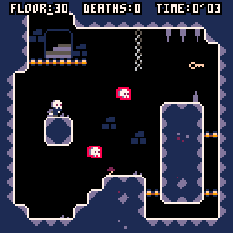
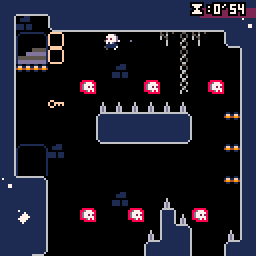

# Raise The Dead

Raise The Dead is an Action Platformer for the Pico-8 in which the player must help a recently resurrected skeleton escape from his crypt. Hop on the magic skulls floating throughout the crypt to find the key to each floor's door!

## Why

The purpose in developing this game was to both to learn how to make pico-8 software and as an attempt to design a game around a single gimmick; In this case, hopping off of enemy heads.

## Controls

* Arrow Keys - Move

* X key - Jump

* Down Key - Fall through the thin wooden floors

* Special Technique - Hold the jump button when hopping off of enemies to jump higher

Note: Currently there is no door graphic for locked doors, I haven't decided if I want to make a locked door sprites, or blocks that gate off the door to the next floor. For now, you need to be holding the key to trigger the door to the next level.

## Getting Started

open .p8 file in the pico-8 environment and play!

## Built With

* [Pico-8 SDK, lua, Atom] - Environments and language used
	

## Version History

0.0.2 update notes

* Added transition mechanics between death and respawn; Won't respawn instantly not and instead will see a message and a prompt to press the X key.
* Added proper timer control to accommodate aforementioned transition. Timer will now pause on death and restart on respawn correctly.
* Additional small UI tweaks
* Tweaked max jump and fall speed to make the game a little easier to react to.  Additionally, reduced slideyness slightly.
* Further reduced difficulty of hazards in levels in order to smooth difficulty curve
* Added various fluff to levels
* Reworked level 5 and finished building the environment
* Tweaked level 7

0.0.1

* Changed the hazard locations a little bit on the first 3 levels to ease the difficulty a little bit; It should be more enjoyable to get your bearings with the physics now.
	
0.0.0

* initial upload	
	
## Known bugs

* Currently when transitioning from level 4 to level 5; you'll take a death no matter what. This is caused by the code I used to check out of bounds collision; I have to think of a way to tweak it to accommodate how my maps are arranged and how I move from level to level.

## Author

Joshua Stimpert

## License

This project is licensed under the MIT License - see the [LICENSE.md](LICENSE.md) file for details

